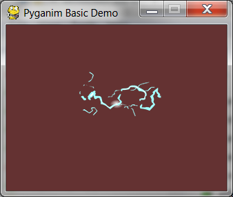

.. default-role:: code
==============
Pyganim Basics
==============

Quick Start
===========

First, create an animation object by calling the PygAnimation constructor and passing it a list of tuples. These tuples represent a single "frame" of the animation. The tuples have an image's filename and the number of milliseconds it is displayed before displaying the next frame:

.. code:: python

    >>> import pyganim
    >>> animObj = pyganim.PygAnimation([('frame1.png', 200), ('frame2.png', 200), ('frame3.png', 600)])
    >>> animObj.play()

Then, during the program's loop when it must draw to the Surface object, call the `blit()` method and pass it the Surface object to draw on along with the XY coordinates:

    animObj.blit(windowSurface, (x, y))

The correct frame will be drawn to the Surface depending on the system time when `blit()` was called.

Example Usage
=============

Here's a small example program, given the following lightning bolt images:

.. image:: bolt_strike_0001.png

.. image:: bolt_strike_0003.png

.. image:: bolt_strike_0005.png

.. image:: bolt_strike_0006.png

.. image:: bolt_strike_0007.png

.. image:: bolt_strike_0008.png

.. image:: bolt_strike_0009.png

.. image:: bolt_strike_0010.png

The source code is:

.. code:: python

    import pygame
    from pygame.locals import *
    import pyganim

    pygame.init()
    windowSurface = pygame.display.set_mode((320, 240), 0, 32)
    pygame.display.set_caption('Pyganim Basic Demo')

    boltAnim = pyganim.PygAnimation([('bolt_strike_0001.png', 100),
                                     ('bolt_strike_0002.png', 100),
                                     ('bolt_strike_0003.png', 100),
                                     ('bolt_strike_0004.png', 100),
                                     ('bolt_strike_0005.png', 100),
                                     ('bolt_strike_0006.png', 100),
                                     ('bolt_strike_0007.png', 100),
                                     ('bolt_strike_0008.png', 100),
                                     ('bolt_strike_0009.png', 100),
                                     ('bolt_strike_0010.png', 100)])
    boltAnim.play()

    while True:
        for event in pygame.event.get():
            if event.type == QUIT:
                pygame.quit()
                sys.exit()

        windowSurface.fill((100, 50, 50))
        boltAnim.blit(windowSurface, (100, 50))
        pygame.display.update()

Other examples exist in the `/examples` folder of the repo at https://github.com/asweigart/pyganim

=================
Play, Pause, Stop
=================

PygAnimation objects have `play()`, `pause()`, and `stop()` methods. The