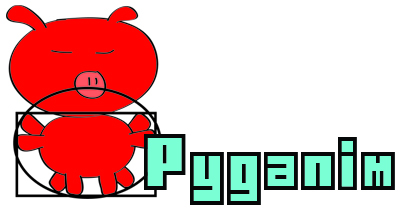

.. default-role:: code
============
Installation
============

Background Information
======================

Pyganim (pronounced like "pig" and "animation") is a Python module for Pygame that makes it easy to add sprite animations to your Pygame programs. Pyganim works with Python 2 and Python 3.

The mascot of Pyganim is a red vitruvian pig.

Pyganim was written by Al Sweigart and released under a "Simplified BSD" license. Contact Al with any questions/bug reports: al@inventwithpython.com

This documentation can be found at https://pyganim.readthedocs.org

Pyganim requires Pygame to run, and also requires PIL or Pillow to use the animated GIF loading feature.

Pyganim runs on Python 2.5, 2.6, 2.7, 3.1, 3.2, 3.3, 3.4.

Currently there is no Pillow module for Python 3.1, so the animated GIF loading does not work on that version. There is no Pygame version currently (Aug 2015) available for Python 3.5.

Installation
============

Pyganim can be installed using pip by running:

    pip install pyganim

The PyPI entry is at https://pypi.python.org/pypi/Pyganim

To test if the installation worked, run `import pyganim` from the interactive shell. Pygame (and, optionally, PIL or Pillow) will need to be installed separately to load animated gifs.