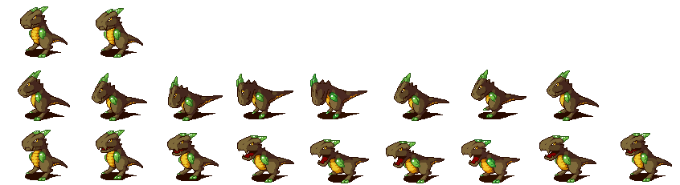

.. default-role:: code
==========================
Loading from Sprite Sheets
==========================

Sprite animations commonly come in "sprite sheet" images, such as this one:

Sprites sheets can be loaded into a PygAnimation object without having to slice the sheet up into individual image files. The sprite sheet's filename is passed to the `getImagesFromSpriteSheet()`, which returns a list of `pygame.Surface` objects.

All the individual images must be the same size. There are three ways to specify how to get the individual images from the sprite sheet:

* Two integers can be passed for the `width` and `height` parameters for the size of the individual cells. The order of the images in the returned list start at the top left, go right across the row, and then to the left side of the next row.

* Two integers can be passed for the `rows` and `cols` parameters for the number of rows and columns of images. The width and height are automatically calculated from the sprite sheet size. The order of the images in the returned list start at the top left, go right across the row, and then to the left side of the next row.

* A list of `(left, top, width, height)` tuples passed for the `rects` parameter for each image from the sprite sheet. The order of the images in the returned list are the same as the `rects` tuples.

Note that the return value from `getImagesFromSpriteSheet()` is just a list of `pygame.Surface` objects, but the `PygAnimation()` constructor requires a list of tuples: a `pygame.Surface` object and the duration of that frame in milliseconds. The built-in `zip()` function is useful for this:

.. code:: python

    >>> import pyganim
    >>> images = pyganim.getImagesFromSpriteSheet(rows=1, cols=3)
    >>> frames = list(zip(images, [200, 200, 600]))
    >>> animObj = pyganim.PygAnimation(frames)
    >>> animObj.play()

Note that in Python 3, `zip()` returns a "zip object" which must be converted into a list for `PygAnimation()`.

See the `examples/sprite_sheet_demo.py` program for an example of loading from a sprite sheet.